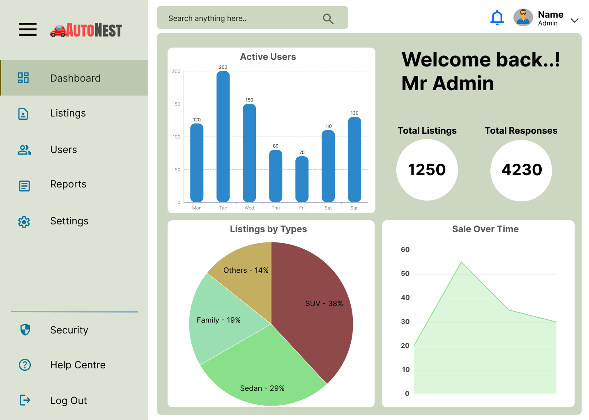

# Car Selling Platform – UI/UX Design

The task includes the **Homepage** (mobile-first design) and **Admin Dashboard** (desktop-first design) with both wireframes and final mockups.  

## Project Overview
The goal of the design is to:
- Make the car buying and selling process simple and engaging for users.
- Help buyers decide quickly without reading too much text.
- Provide admins with clear, actionable insights via an organized dashboard.
- Maintain design consistency through a reusable component system.

## 🛠 Tools Used
- **Figma** – Wireframing & final UI design
- **Figma Components** – For reusable design elements

## Homepage (Mobile View)

### Wireframe

### Final Mockup

## Admin Dashboard (Desktop View)

### Wireframe

### Final Mockup

##  Design System Highlights
- **Color Palette:** Consistent and minimal for clarity.
- **Typography:** Clear hierarchy with readable font sizes.
- **Components:** Reusable buttons, cards, and navigation for scalability.

